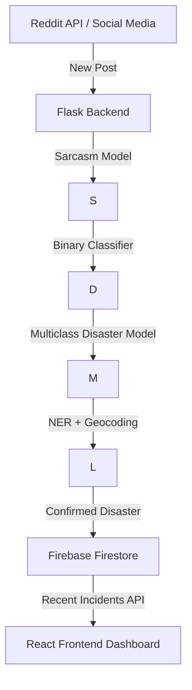

# Disaster Alert System - Emergency Management Dashboard

A professional **AI-powered command center** designed for emergency dispatch operators and crisis management teams.  
Currently in **active development**:  
- ✅ Frontend created with **demo data**  
- ✅ Backend ready with **custom ML models** & APIs  
- 🔄 Integration work in progress (connecting frontend with backend & Firestore)  

---

## 🔬 Machine Learning & AI Models

This system is powered by **custom fine-tuned NLP models** built using **Hugging Face Transformers**.  
Each stage of analysis is handled by a specialized model:

1. **Sarcasm Detection Model**  
   - Fine-tuned on social media datasets.  
   - Purpose: Filter out sarcastic / ironic posts that mention disasters but are not real incidents.  
   - Example:  
     - Input: `"Wow, what an amazing earthquake! My coffee spilled 🙄"`  
     - Output: `"sarcasm: true"` → ignored from pipeline.  

2. **Binary Disaster Classifier**  
   - Model trained to identify whether a text indicates a **real disaster event** or **not**.  
   - Input: `"Severe flooding in Pakistan displaces thousands"`  
   - Output: `"disaster: true (0.97 confidence)"`.  

3. **Multiclass Disaster Classifier**  
   - Classifies the **type of disaster** (11 categories currently supported).  
   - Labels: `["earthquake", "flood", "fire", "hurricane", "tornado", "volcano", "landslide", "tsunami", "cyclone", "storm", "other"]`  
   - Example:  
     - Input: `"Massive earthquake in Japan, tsunami warning issued"`  
     - Output: `"earthquake"`.  

4. **NER Location Extractor**  
   - Pre-trained **Named Entity Recognition (NER)** model (`dslim/bert-base-NER`).  
   - Extracts **places** mentioned in text (cities, countries, regions).  
   - Integrated with **OpenStreetMap Nominatim API** to convert names → GPS coordinates.  

---

## 🌐 Reddit Data Pipeline

We use the **Reddit API (PRAW)** to collect **real-time posts** from multiple subreddits related to disasters:  
- Examples: `news`, `TropicalWeather`, `Earthquakes`, `Volcanoes`, `StormComing`, etc.  
- Each new Reddit post is streamed → sent to the **backend `/analyze` API**.  

### Processing Flow:
1. Reddit Post Captured (`title + body`).  
2. Text sent to **Flask API → ML Pipeline**.  
3. Models applied in sequence:  
   - Sarcasm filter → Binary classifier → Disaster type classifier → Location NER.  
4. If confirmed as **real disaster**, incident stored in **Firebase Firestore** with:  
   - `text, type, confidence, location, timestamp`.  
5. Frontend fetches **recent incidents (last 30 days)** via API → displays on **map & dashboard**.  

---

## 🚨 Key Features

- **AI-powered disaster monitoring** with fine-tuned NLP models  
- **Reddit real-time pipeline** for early-warning disaster signals  
- **Firestore integration** for real-time storage & frontend syncing  
- **Confidence scoring & sarcasm filtering** to reduce false alarms  
- **Map visualization** with location extraction + geocoding  

---

## 📊 System Architecture

---

## 🛠️ Technology Stack

- **Frontend**: React + TypeScript + Vite  
- **Styling**: Tailwind CSS (custom emergency theme)  
- **Charts**: Recharts (trend analytics)  
- **Maps**: OpenStreetMap + Mapbox integration  
- **Backend**: Flask + Hugging Face Transformers  
- **Database**: Firebase Firestore (real-time storage)  
- **Data Sources**: Reddit API, (Twitter/X optional)  

---

## 🔧 Development Status

- Frontend: Completed with **mock/demo data**  
- Backend: Completed (API endpoints + ML models)  
- Integration: Ongoing (backend ↔ frontend ↔ Firestore)  

---

🚧 **Note**: This project is currently in **active development**.  
- The **backend AI models** are functional & fine-tuned.  
- The **frontend dashboard** is live with mock data.  
- Next phase: Full **integration & real-time pipelines**.  
